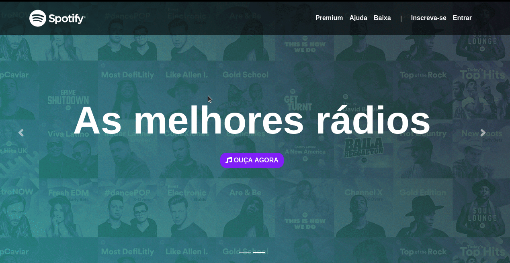

<h1 align="center">
 
  
 
 
   
   
</h1>

<h2 align="center">Clone do site spotify </h2>

  
  

## Features
[//]: # (Add the features of your project here:)
Tecnologias usadas para o desenvolvimento do projeto!

-  **Html 5** — Usada pra compor todo o contéudo do pagína.
-  **CSS / Bootstrap** — Usado o bootstrap para forma o design da pagina.

## License

Este projeto está licenciado sob a Licença MIT - Consulte a **[LICENSE](https://opensource.org/licenses/MIT)** para mais detalhes
